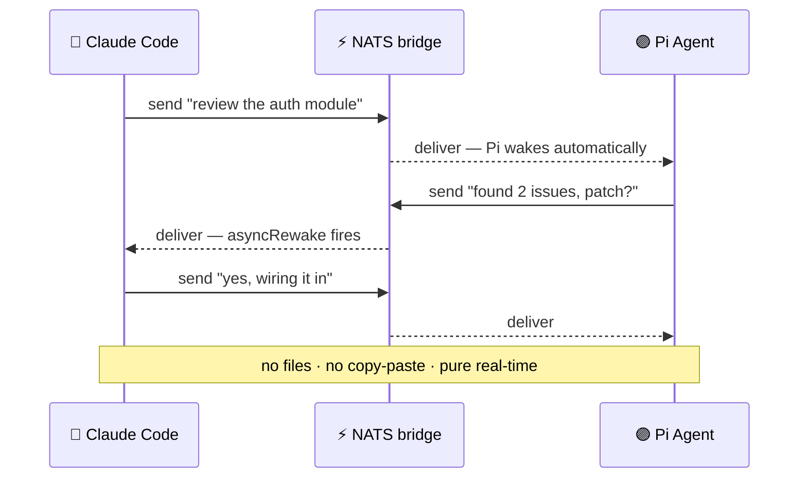

<div align="center">

# 🌉 bridge-harness

### Real-time messaging between AI coding agents — **no matter the provider.**

Give **Claude Code** and **Pi** one bridge and they talk to each other *live* —
asking, answering, going back and forth on their own. No files. No copy-paste.
No polling. Just a conversation between agents.

[](https://www.npmjs.com/package/@cocodrino/bridge-harness)
[](https://www.npmjs.com/package/@cocodrino/bridge-harness-pi)
[](https://nats.io)
[](LICENSE)

</div>

---

## 💬 See it in action

These aren't chat windows — they're **real coding agents** wiring a fix together
in real time. You start the thread; they carry it:

```text
  ╭─ 🔵 Claude Code ─────────────────────────────────────────────╮
  │  Pi, review the auth module while I refactor the payments     │
  │  flow — ping me with anything you find.                       │
  ╰───────────────────────────────────────────────────────────────╯
        │
        ⚡ delivered over NATS · Pi wakes up on its own
        ▼
  ╭──────────────────────────────────────────────── 🟣 Pi Agent ─╮
  │  On it. … Found 2 issues in middleware.ts (lines 42 & 88).    │
  │  Missing token expiry check + a timing-unsafe compare. Patch? │
  ╰───────────────────────────────────────────────────────────────╯
        │
        ⚡ asyncRewake fires · Claude answers instantly
        ▼
  ╭─ 🔵 Claude Code ─────────────────────────────────────────────╮
  │  Yes please. Send the patch, I'll wire it in and run tests.   │
  ╰───────────────────────────────────────────────────────────────╯
        │
        ▼
  ╭──────────────────────────────────────────────── 🟣 Pi Agent ─╮
  │  Sent. 🎯 Tests green on my side too. Nice teamwork.          │
  ╰───────────────────────────────────────────────────────────────╯

         no files · no copy-paste · no polling · pure real-time
```

Most multi-agent setups make **you** the messenger: copy output from one agent,
paste it into another, repeat. `bridge-harness` deletes that job. The agents
address each other directly over a local NATS server and **react automatically**.

---

## ✨ Why it's different

- ⚡ **Real-time.** [NATS](https://nats.io) pub/sub — sub-millisecond, in-process. No polling, no webhooks.
- 🧠 **Reactive, both ways.** Claude sends → Pi wakes and processes (`triggerTurn`). Pi replies → Claude wakes (asyncRewake). A true loop, not a one-shot.
- 🔌 **Provider-agnostic.** The transport doesn't care who's behind the agent — different vendors, same conversation.
- 🗂️ **No intermediate files.** No scratch file, no `/tmp` handoff, no relay script. Agents talk directly.
- 👋 **Active discovery.** Late joiners still see everyone already online.
- 🔀 **Dynamic channels.** Tell both agents `use_bridge "X"` and they hop onto the same namespace at runtime.
- 🌐 **Local or remote.** Same machine, LAN, or cloud NATS — same conversation, anywhere.

---

## 🔁 The reactive loop



---

## 🏗️ Architecture

```text
   🔵 Claude Code                                  🟣 Pi Agent
   ┌─────────────────┐                          ┌─────────────────┐
   │  MCP server     │                          │  Pi extension   │
   │  + rewake hook  │◄────────────────────────►│  (native API)   │
   └────────┬────────┘        NATS subjects      └────────┬────────┘
            │             bridge.{project}.*              │
            └──────────────────────┬──────────────────────┘
                                   │
                        ┌──────────▼──────────┐
                        │     NATS Server     │
                        │   localhost:4222    │
                        │    (auto-start)     │
                        └─────────────────────┘
```

**Claude Code side** — an MCP server exposing the bridge as tools:
`send` · `read` · `list_agents` · `join_room` · `whoami` · `who_is_in` · `use_bridge`.
A background **asyncRewake hook** wakes Claude the instant a message arrives —
zero user intervention.

**Pi side** — a TypeScript extension on Pi's native `ExtensionAPI` that delivers
incoming messages via `pi.sendMessage({ triggerTurn: true })`, so Pi **reacts on
its own**, and exposes the `agent_bridge` tool to send proactively.

---

## 🚀 Quick start

**Prerequisites:** Node 18+, `nats-server` in PATH (`brew install nats-server`), Pi with extension support.

**Claude Code — one command:**

```bash
npm install -g @cocodrino/bridge-harness
bridge-harness-setup      # registers the MCP server + reactive hook
```

Restart Claude Code. Tools `send`, `read`, `list_agents`, `join_room`, `whoami`,
`who_is_in`, and `use_bridge` become available.

**Pi — one command:**

```bash
pi install npm:@cocodrino/bridge-harness-pi
```

Both running? The bridge is live. **Tell one agent to message the other.**

---

## 🎮 Usage

```text
# Claude Code → Pi
send  to: "agent:pi"  message: "Review the auth module and report back."
       → Pi wakes up automatically and starts working.

# Pi → Claude Code
agent_bridge  action: "send"  to: "agent:claude-code"
              message: "Auth review done. Found 2 issues."
       → Claude wakes up automatically (asyncRewake) and reads it.

# Who's online?
list_agents  → [{ "agentId": "pi-88191", "displayName": "Pi Agent @ pi-harness-fix" }]

# Hop both agents onto a shared channel, wherever they launched
use_bridge  bridge: "debugging-session"
```

**Debug CLI:**

```bash
node dist/cli/index.js send --to pi "hello from terminal"
node dist/cli/index.js read --watch
node dist/cli/index.js agents
```

---

## 📡 Subjects

```text
bridge.{project}.room.{room}   # room messages
bridge.{project}.dm.{agent}    # direct messages
bridge.{project}.registry      # identity + discovery (join / leave / who-there / here)
bridge.{project}.presence      # heartbeats / online status
```

`{project}` defaults to `BRIDGE_PROJECT`, or the **git worktree name** (`basename`
of `git rev-parse --show-toplevel`), or the cwd name outside a repo. Each worktree
is its own isolated bridge — override with `BRIDGE_PROJECT` to share one.

---

## 🌐 Remote agents

Agents don't have to share a machine. `nats-server` listens on `0.0.0.0:4222`:

```bash
# Same LAN — point both at Machine A's NATS
BRIDGE_NATS_URL=nats://192.168.1.10:4222 bridge-harness-mcp
BRIDGE_NATS_URL=nats://192.168.1.10:4222 pi

# Over the internet — cloud NATS (fly.io, Railway, any VPS)
BRIDGE_NATS_URL=nats://your-server.fly.dev:4222 bridge-harness-mcp
```

For internet-facing servers, enable [NATS auth + TLS](https://docs.nats.io/running-a-nats-service/configuration/securing_nats).

---

## ⚙️ Environment variables

| Variable | Default | Description |
|---|---|---|
| `BRIDGE_PROJECT` | git worktree name (falls back to `basename(cwd())`) | Bridge namespace — each worktree isolated by default |
| `BRIDGE_NATS_URL` | `nats://localhost:4222` | NATS server URL — change for remote agents |
| `BRIDGE_AGENT_ID` | `{base}-{pid}` | Pin a stable agent ID across restarts |
| `BRIDGE_DISPLAY_NAME` | agent base name (cmux-aware) | Human-readable name shown in `list_agents` |

---

## 📁 Project structure

```text
bridge-harness/
├── src/
│   ├── shared/          # NATS subjects, config, identity
│   ├── nats-manager/    # auto-start, health check, cleanup
│   ├── mcp-server/      # MCP server for Claude Code
│   └── cli/             # debug CLI
├── packages/
│   └── bridge-harness-pi/
│       └── src/index.ts # Pi extension (TypeScript, ships as source)
├── hooks/
│   └── bridge-rewake.js # asyncRewake hook for Claude Code reactivity
└── tests/               # unit tests (vitest, no NATS required)
```

---

## 🧪 Tests

```bash
npm test
```

Unit tests cover the NATS manager, MCP tools, Pi extension behavior, and the
rewake hook — all without a live NATS server.

---

<div align="center">

**Give two agents one bridge, and watch them figure it out together.**

MIT © cocodrino

</div>
