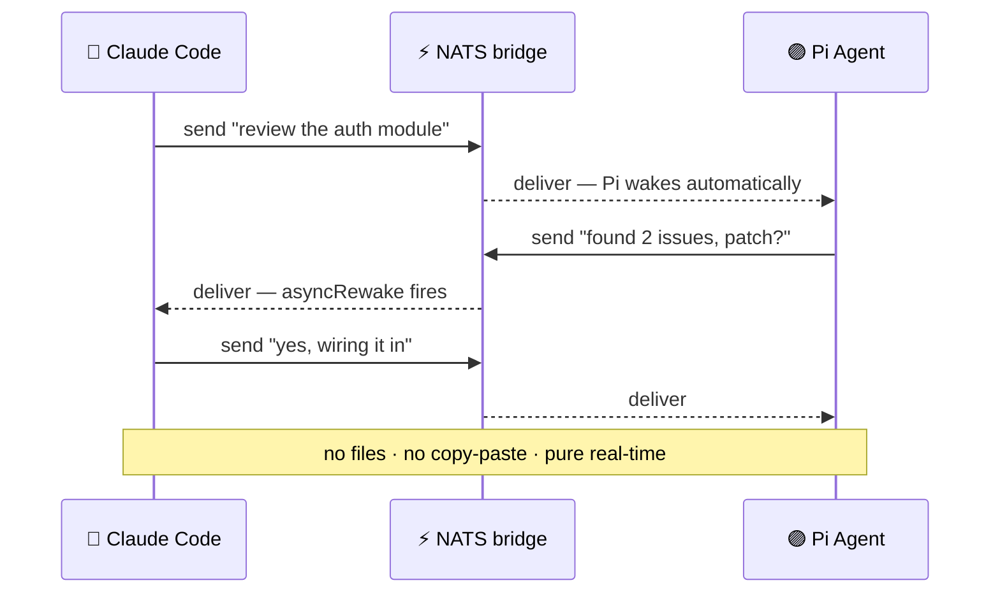

<div align="center">

# 🌉 bridge-harness

### Real-time messaging between AI coding agents — **no matter the provider.**

Give **Claude Code** and **Pi** one bridge and they talk to each other *live* —
asking, answering, going back and forth on their own. No files. No copy-paste.
No polling. Just a conversation between agents.

[](https://www.npmjs.com/package/@cocodrino/bridge-harness)
[](https://www.npmjs.com/package/@cocodrino/bridge-harness-pi)
[](https://nats.io)
[](LICENSE)

</div>

---

## 💬 See it in action

These aren't chat windows — they're **real coding agents** wiring a fix together
in real time. You start the thread; they carry it:

```text
  ╭─ 🔵 Claude Code ─────────────────────────────────────────────╮
  │  Pi, review the auth module while I refactor the payments     │
  │  flow — ping me with anything you find.                       │
  ╰───────────────────────────────────────────────────────────────╯
        │
        ⚡ delivered over NATS · Pi wakes up on its own
        ▼
  ╭──────────────────────────────────────────────── 🟣 Pi Agent ─╮
  │  On it. … Found 2 issues in middleware.ts (lines 42 & 88).    │
  │  Missing token expiry check + a timing-unsafe compare. Patch? │
  ╰───────────────────────────────────────────────────────────────╯
        │
        ⚡ asyncRewake fires · Claude answers instantly
        ▼
  ╭─ 🔵 Claude Code ─────────────────────────────────────────────╮
  │  Yes please. Send the patch, I'll wire it in and run tests.   │
  ╰───────────────────────────────────────────────────────────────╯
        │
        ▼
  ╭──────────────────────────────────────────────── 🟣 Pi Agent ─╮
  │  Sent. 🎯 Tests green on my side too. Nice teamwork.          │
  ╰───────────────────────────────────────────────────────────────╯

         no files · no copy-paste · no polling · pure real-time
```

Most multi-agent setups make **you** the messenger: copy output from one agent,
paste it into another, repeat. `bridge-harness` deletes that job. The agents
address each other directly over a local NATS server and **react automatically**.

---

## ✨ Why it's different

- ⚡ **Real-time.** [NATS](https://nats.io) pub/sub — sub-millisecond, in-process. No polling, no webhooks.
- 🧠 **Reactive, both ways.** Claude sends → Pi wakes and processes (`triggerTurn`). Pi replies → Claude wakes (asyncRewake). A true loop, not a one-shot.
- 🔌 **Provider-agnostic.** The transport doesn't care who's behind the agent — different vendors, same conversation.
- 🗂️ **No intermediate files.** No scratch file, no `/tmp` handoff, no relay script. Agents talk directly.
- 🎯 **Reach anyone by identity.** DM `agent:<id>` and it lands across any project or git worktree — no shared room or matching config.
- 👋 **Global discovery.** `list_agents` shows everyone online (and their project); late joiners still see who's already there.
- 🏠 **Isolated rooms.** Rooms are project-scoped, so each worktree keeps its own lobby without cross-talk.
- 🌐 **Local or remote.** Same machine, LAN, or cloud NATS — same conversation, anywhere.

---

## 🔁 The reactive loop


```mermaid
sequenceDiagram
    participant C as 🔵 Claude Code
    participant N as ⚡ NATS bridge
    participant P as 🟣 Pi Agent
    C->>N: send "review the auth module"
    N-->>P: deliver — Pi wakes automatically
    P->>N: send "found 2 issues, patch?"
    N-->>C: deliver — asyncRewake fires
    C->>N: send "yes, wiring it in"
    N-->>P: deliver
    Note over C,P: no files · no copy-paste · pure real-time
```

---

## 🏗️ Architecture

```text
   🔵 Claude Code                                  🟣 Pi Agent
   ┌─────────────────┐                          ┌─────────────────┐
   │  MCP server     │                          │  Pi extension   │
   │  + rewake hook  │◄────────────────────────►│  (native API)   │
   └────────┬────────┘        NATS subjects      └────────┬────────┘
            │             bridge.{project}.*              │
            └──────────────────────┬──────────────────────┘
                                   │
                        ┌──────────▼──────────┐
                        │     NATS Server     │
                        │   localhost:4222    │
                        │    (auto-start)     │
                        └─────────────────────┘
```

**Claude Code side** — an MCP server exposing the bridge as tools:
`send` · `read` · `list_agents` · `join_room` · `whoami` · `who_is_in` · `use_bridge`.
A background **asyncRewake hook** wakes Claude the instant a message arrives —
zero user intervention.

**Pi side** — a TypeScript extension on Pi's native `ExtensionAPI` that delivers
incoming messages via `pi.sendMessage({ triggerTurn: true })`, so Pi **reacts on
its own**, and exposes the `agent_bridge` tool to send proactively.

---

## 🚀 Quick start

**Prerequisites:** Node 18+, `nats-server` in PATH (`brew install nats-server`), Pi with extension support.

**Claude Code — one command:**

```bash
npm install -g @cocodrino/bridge-harness
bridge-harness-setup   # registers the MCP server + reactive hook + agent-bridge skill
```

Restart Claude Code. Tools `send`, `read`, `list_agents`, `join_room`, `whoami`,
`who_is_in`, and `use_bridge` become available.

**Pi — one command:**

```bash
pi install npm:@cocodrino/bridge-harness-pi
```

Both running? The bridge is live. **Tell one agent to message the other.**

### The `agent-bridge` skill

Both packages ship a single, unified **`agent-bridge` skill** that teaches the agent
how to operate the bridge correctly — routing model, discovery, `use_bridge`, and
keeping its room aligned with the git worktree. It documents both call styles (direct
tools on Claude Code / Codex, and `agent_bridge action=…` on Pi), so one file works
everywhere. It installs automatically:

- **Claude Code:** `bridge-harness-setup` copies it to `~/.claude/skills/agent-bridge/`.
- **Pi:** declared via the `pi.skills` field, so `pi install` picks it up.

**Install it into any agents you choose** with the interactive installer:

```bash
bridge-harness-skills          # pick agents (Claude Code, Pi, Codex, …)
bridge-harness-skills --all    # install to all detected, non-interactively
bridge-harness-skills --force  # overwrite an existing copy
```

It detects each agent by its skills directory, skips ones that already have it (unless
`--force`), and won't clobber your customizations — delete a copy and re-run to update.

Trigger the skill by saying *"activa bridge harness"* or asking *"who's connected on the bridge?"*.

---

## 🎮 Usage

```text
# Claude Code → Pi
send  to: "agent:pi"  message: "Review the auth module and report back."
       → Pi wakes up automatically and starts working.

# Pi → Claude Code
agent_bridge  action: "send"  to: "agent:claude-code"
              message: "Auth review done. Found 2 issues."
       → Claude wakes up automatically (asyncRewake) and reads it.

# Who's online?
list_agents  → [{ "agentId": "pi-88191", "displayName": "Pi Agent @ pi-harness-fix" }]

# Hop both agents onto a shared channel, wherever they launched
use_bridge  bridge: "debugging-session"
```

**Debug CLI:**

```bash
node dist/cli/index.js send --to pi "hello from terminal"
node dist/cli/index.js read --watch
node dist/cli/index.js agents
```

---

## 📡 Subjects & routing model

```text
bridge.dm.{agent}              # direct messages  — GLOBAL (by identity)
bridge.registry                # identity + discovery (join / leave / who-there / here) — GLOBAL
bridge.presence                # heartbeats / online status — GLOBAL
bridge.{project}.room.{room}   # room messages    — scoped to a project
```

**The key model:** DMs and discovery are **global by identity** — you can `send` to
`agent:<id>` and it reaches that agent across **any** project or git worktree, and
`list_agents` shows everyone (with their `project`). **Rooms are project-scoped**, so
each worktree keeps an isolated lobby; a room only reaches agents in the same project.

To reach an agent in another worktree, **DM it by `agentId`** — no room-joining or
`use_bridge` needed. Use `use_bridge` only to *share a room* with another project.

**DM durability (JetStream).** `bridge.dm.*` is captured by a JetStream stream
(30-min / 100-per-recipient retention), so the rewake hook wakes Claude for **every**
DM — including replies that arrive during its restart — through a durable consumer that
gets redelivered anything it missed, and offline recipients catch up on reconnect within
the window. Rooms stay ephemeral core-NATS. The bundled `nats-server` auto-start enables
JetStream (`-js`); a remote server must run with it too.

`{project}` defaults to `BRIDGE_PROJECT`, or the **git worktree name** (`basename`
of `git rev-parse --show-toplevel`), or the cwd name outside a repo. Each worktree
has its own isolated rooms — override with `BRIDGE_PROJECT` to share them.

---

## 🌐 Remote agents

Agents don't have to share a machine. `nats-server` listens on `0.0.0.0:4222`:

```bash
# Same LAN — point both at Machine A's NATS
BRIDGE_NATS_URL=nats://192.168.1.10:4222 bridge-harness-mcp
BRIDGE_NATS_URL=nats://192.168.1.10:4222 pi

# Over the internet — cloud NATS (fly.io, Railway, any VPS)
BRIDGE_NATS_URL=nats://your-server.fly.dev:4222 bridge-harness-mcp
```

For internet-facing servers, enable [NATS auth + TLS](https://docs.nats.io/running-a-nats-service/configuration/securing_nats).
Same NATS URL = same bridge: DMs and discovery work across everyone connected; rooms stay grouped by project.

---

## ⚙️ Environment variables

| Variable | Default | Description |
|---|---|---|
| `BRIDGE_PROJECT` | git worktree name (falls back to `basename(cwd())`) | Scopes your **rooms** (isolated per worktree). DMs and discovery are global and ignore this. |
| `BRIDGE_NATS_URL` | `nats://localhost:4222` | NATS server URL — change for remote agents |
| `BRIDGE_AGENT_ID` | `{base}-{pid}` | Pin a stable agent ID across restarts (how others DM you) |
| `BRIDGE_DISPLAY_NAME` | agent base name (cmux-aware) | Human-readable name shown in `list_agents` |

---

## 📁 Project structure

```text
bridge-harness/
├── src/
│   ├── shared/          # NATS subjects, config, identity
│   ├── nats-manager/    # auto-start, health check, cleanup
│   ├── mcp-server/      # MCP server for Claude Code
│   └── cli/             # debug CLI
├── packages/
│   └── bridge-harness-pi/
│       └── src/index.ts # Pi extension (TypeScript, ships as source)
├── hooks/
│   └── bridge-rewake.js # asyncRewake hook for Claude Code reactivity
└── tests/               # unit tests (vitest, no NATS required)
```

---

## 🧪 Tests

```bash
npm test
```

Unit tests cover the NATS manager, MCP tools, Pi extension behavior, and the
rewake hook — all without a live NATS server.

---

<div align="center">

**Give two agents one bridge, and watch them figure it out together.**

MIT © cocodrino

</div>
