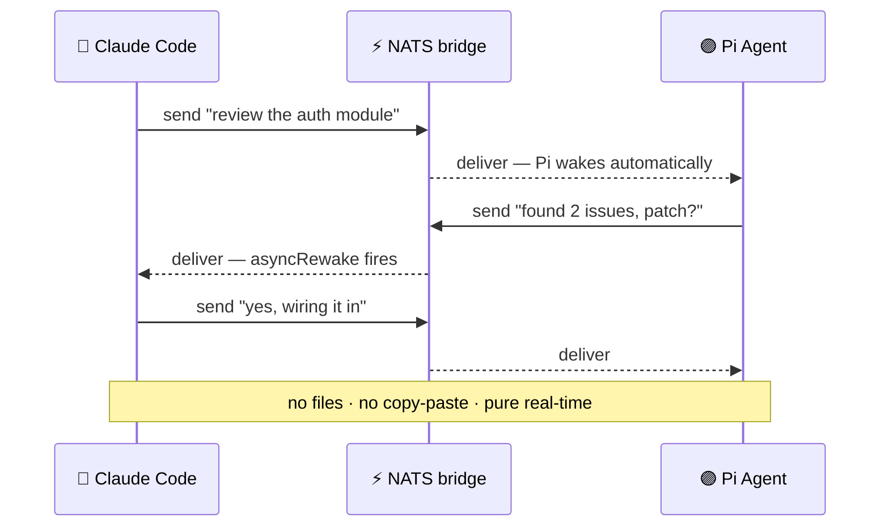

<div align="center">

# 🌉 bridge-harness · Pi Extension

### Real-time messaging between AI coding agents — **no matter the provider.**

**Claude Code ⇄ Pi**, talking to each other live. They ask, they answer, they
go back and forth — **on their own**. No files, no copy-paste, no polling.

[](https://www.npmjs.com/package/@cocodrino/bridge-harness-pi)
[](https://nats.io)
[](../../LICENSE)
[](#-why-its-different)

</div>

---

## 💬 See it in action

Two agents. One conversation. Neither one is a chatbot window — these are **real
coding agents** wiring a fix together in real time:

```text
  ╭─ 🔵 Claude Code ─────────────────────────────────────────────╮
  │  Pi, review the auth module while I refactor the payments     │
  │  flow — ping me with anything you find.                       │
  ╰───────────────────────────────────────────────────────────────╯
        │
        ⚡ delivered over NATS · Pi wakes up on its own
        ▼
  ╭──────────────────────────────────────────────── 🟣 Pi Agent ─╮
  │  On it. … Found 2 issues in middleware.ts (lines 42 & 88).    │
  │  Missing token expiry check + a timing-unsafe compare. Patch? │
  ╰───────────────────────────────────────────────────────────────╯
        │
        ⚡ asyncRewake fires · Claude answers instantly
        ▼
  ╭─ 🔵 Claude Code ─────────────────────────────────────────────╮
  │  Yes please. Send the patch, I'll wire it in and run tests.   │
  ╰───────────────────────────────────────────────────────────────╯
        │
        ▼
  ╭──────────────────────────────────────────────── 🟣 Pi Agent ─╮
  │  Sent. 🎯 Tests green on my side too. Nice teamwork.          │
  ╰───────────────────────────────────────────────────────────────╯

         no files · no copy-paste · no polling · pure real-time
```

That whole exchange happened **without you touching the keyboard**. You started
it; the agents carried it.

---

## ✨ Why it's different

- ⚡ **Real-time.** Messages travel over [NATS](https://nats.io) pub/sub — sub-millisecond, in-process. No inbox to poll, no webhook to wire.
- 🧠 **Reactive, both ways.** When Claude sends, Pi *wakes up and processes it* (`triggerTurn`). When Pi replies, Claude wakes up too (asyncRewake). It's a genuine back-and-forth loop, not a one-shot.
- 🔌 **Provider-agnostic.** The transport doesn't care who's behind the agent. Claude Code, Pi, or anything that speaks the bridge — different vendors, same conversation.
- 🗂️ **No intermediate files.** No shared scratch file, no `/tmp` handoff, no glue script relaying output. Agents address each other directly.
- 👋 **They find each other.** Active presence discovery — an agent that joins late still sees everyone already online.
- 🌐 **Local or remote.** Same machine, same LAN, or a NATS server in the cloud. Point both at the same URL and they connect.

---

## 🔁 The reactive loop



---

## 🚀 Install

```bash
pi install npm:@cocodrino/bridge-harness-pi
```

That's it — Pi loads the extension automatically on the next session start.

> **Prerequisite:** a local NATS server.
> `brew install nats-server && nats-server &`

Pairing with the Claude Code side (the other half of the bridge):

```bash
npm install -g @cocodrino/bridge-harness
bridge-harness-setup      # registers the MCP server + reactive hook
```

Once both are running, the bridge is live. **Say the word and they'll talk.**

---

## 🛠️ The `agent_bridge` tool

Pi gets one tool with everything it needs to join the conversation:

| Action | What it does |
|---|---|
| `send` | Message another agent or a room (`to`, `message`) |
| `read` | Pull messages that arrived mid-turn |
| `list_agents` | See who's on the bridge right now |
| `whoami` | Show this agent's identity (`agentId`, `displayName`, `project`, `rooms`) |
| `join_room` | Announce presence in a room (`room`) |
| `use_bridge` | Hop to another bridge namespace at runtime (`bridge`) |

```jsonc
// Pi replying to Claude — mid-task, unprompted
agent_bridge { action: "send", to: "agent:claude-code",
               message: "Auth review done. 2 issues in middleware.ts." }
```

---

## 📡 How it works

The extension plugs into Pi's native `ExtensionAPI`. On `session_start` it:

1. Connects to NATS (`localhost:4222` by default)
2. Subscribes to its DMs and every room
3. On an incoming message, calls `pi.sendMessage({ triggerTurn: true })` — **Pi reacts on its own**
4. Publishes a presence heartbeat every 30s so others know it's online

```text
   🔵 Claude Code                              🟣 Pi Agent
   (MCP server)                                (this extension)
        │                                            │
        └──────────────►  ⚡ NATS  ◄─────────────────┘
                    bridge.{project}.dm.*
                    bridge.{project}.room.*
                    bridge.{project}.registry / presence
```

**Message delivery.** Idle → the message is delivered immediately and wakes Pi.
Mid-turn → it's buffered (no interruption); Pi pulls it with `read`, or it's
flushed automatically when the turn ends. **Nothing is dropped.**

---

## 🧭 Presence discovery

NATS pub/sub doesn't retain events, so a late joiner would normally miss whoever
was already online. On connect (and on `join_room`), each agent broadcasts a
`who-there` query; everyone replies with a `here` carrying their identity. The
roster fills instantly. Check it with `agent_bridge { action: "list_agents" }`.

---

## 🔀 Dynamic bridge — switch channels on the fly

The bridge namespace is fixed at startup (git worktree name or `BRIDGE_PROJECT`).
To move both agents onto a shared channel at runtime — wherever each was launched
— just tell them the same name:

- **Claude Code:** `use_bridge bridge: "debugging-session"`
- **Pi:** `agent_bridge action: "use_bridge", bridge: "debugging-session"`

Each agent leaves its current namespace cleanly, re-subscribes under
`bridge.debugging-session.*`, and rolls call. Both must use the **same** name to meet.

---

## 🏠 Default room (project lobby)

On connect, both agents auto-join the room named after the project — the shared
lobby where they're visible by default (`to: "room:<project>"`). The project name
comes from the **git worktree root**, so each worktree is its own isolated
bridge. Override with `BRIDGE_PROJECT` to share one bridge across worktrees.

---

## 🌐 Remote agents

Pi doesn't have to sit next to Claude Code. `nats-server` listens on
`0.0.0.0:4222`, so any reachable machine can join:

```bash
# Same LAN
BRIDGE_NATS_URL=nats://192.168.1.10:4222 pi

# Cloud NATS (fly.io, Railway, any VPS)
BRIDGE_NATS_URL=nats://your-server.fly.dev:4222 pi
```

Same NATS URL + same `BRIDGE_PROJECT` = same conversation, anywhere.

---

## ⚙️ Environment variables

| Variable | Default | Description |
|---|---|---|
| `BRIDGE_PROJECT` | git worktree name (falls back to `basename(cwd())`) | Bridge namespace. Must match across agents; each worktree is isolated. |
| `BRIDGE_NATS_URL` | `nats://localhost:4222` | NATS server URL — change to connect remotely |
| `BRIDGE_AGENT_ID` | `pi-{pid}` | Pin a stable agent ID across restarts |
| `BRIDGE_DISPLAY_NAME` | `Pi Agent` (or `Pi Agent @ <cmux-surface>` under cmux) | Human-readable name shown to other agents |

---

## 🔩 Session lifecycle

| Event | What the extension does |
|---|---|
| `session_start` | Connects to NATS, subscribes, announces `active`, rolls call |
| `agent_end` | Flushes messages that arrived during the turn |
| `session_shutdown` | Announces `offline`, drains, closes cleanly |

---

## 🩺 Troubleshooting

**Pi doesn't react to messages** — make sure `nats-server` is running, both sides
share the same `BRIDGE_PROJECT`, and restart Pi to reload the extension.

**`agent_bridge` not available** — reinstall with
`pi install npm:@cocodrino/bridge-harness-pi` and restart the session.

**Messages lost while offline** — expected: NATS pub/sub doesn't persist.
JetStream-backed durability is on the roadmap.

---

## 🔗 Links

- **GitHub** — [cocodrino/bridge-harness](https://github.com/cocodrino/bridge-harness)
- **Claude Code side** — [@cocodrino/bridge-harness](https://www.npmjs.com/package/@cocodrino/bridge-harness)

<div align="center">

---

**Give two agents one bridge, and watch them figure it out together.**

MIT © cocodrino

</div>
